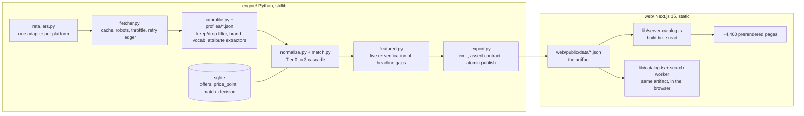

# vale.cr

A price comparison engine for Costa Rican appliances and electronics.
Live at **[vale.cr](https://vale.cr)**: thirteen retailers, about 4,300
products, rebuilt and redeployed every morning by one unattended job.

This repository is a public snapshot of that system for review. It is the
whole pipeline (collect, normalise, match, publish, render) with one part
withheld: the adapters that read the real retailers. In their place is one
adapter that reads saved pages off disk, so the engine runs end to end, the
tests pass, and the site builds, without a single request leaving your machine.
See [What is not here](#what-is-not-here-and-why) for the exact list.

## The problem

Costa Rica has a handful of appliance chains, most of them financing-driven,
and no independent way to see the same model priced across them. The retail
price of a refrigerator can differ by a third between two shops on the same
street, and nobody publishes that.

The engineering problem underneath is identity: each retailer describes the
same product with a different title, a different SKU scheme, sometimes a
different photo, and only sometimes a barcode. Comparing prices is easy.
Deciding that two listings are the same product, without ever saying so when
they are not, is the hard part.

## The one finding worth keeping

A price comparison site is only worth building where prices actually differ.

The project was stopped once, on a single measured number: median
cross-retailer dispersion was 3.0%. Adding retailers makes the catalogue
bigger; it does not make chains disagree more. It restarted on a different
finding: a member-owned cooperative prices on a different logic than the
financing-driven chains, and its median gap against the best chain price was
10.1%, cheaper on 34 of 61 shared products. That is where the spread lives.

So before building this for another market: scrape two or three chains, match
a hundred products, and look at the median gap first.

## Architecture



Two rules hold the whole thing together:

1. **The engine owns the artifact; the site only reads it.** Nothing in `web/`
   ever talks to a retailer. `web/public/data/` is the single interface, and
   `export.assert_contract()` refuses to publish anything that violates it.
2. **The extraction ladder has two rungs and no third.** Rung 1 is a platform's
   own public JSON; rung 2 is schema.org structured data (JSON-LD or
   microdata). There are no CSS selectors anywhere. A selector couples your
   prices to someone else's theme and rots on their next redesign.

Adding a category is a JSON file (`engine/profiles/`). Adding a retailer on a
platform the engine already knows is a subclass with four constants. Neither
touches the matcher.

## How the matching engine works

Matching runs strictly inside one category and is deterministic. Precision
over recall throughout: a false match publishes a wrong verdict under a
headline, a missed match publishes two honest single-retailer cards.

**Tier 0, normalise** (`normalize.py`, `catprofile.py`). Uppercase, strip
accents, resolve the brand through the profile's vocabulary and aliases, pull
every declared attribute out of the title with the profile's regex extractors,
and find a model-number candidate: five to eighteen characters, at least two
letters and two digits, not on the spec-token blocklist. `HDR10` and `256GB`
look like model numbers and are not; that blocklist exists because one of them
once joined a 43-inch TV to a 65-inch TV and published the largest gap in the
catalogue.

**Tier 1a, barcode.** Same EAN at two retailers. Accepted at 1.00.

**Tier 1b, model stem.** Same model number (suffix after `/` stripped,
separators removed) at two retailers, and the two brands must not contradict.
Accepted at 0.99. This tier carries most accepted pairs.

**Tier 2, spec fingerprint.** The profile declares which attributes constitute
identity (for a refrigerator: brand, capacity rounded to 0.5 ft³, door
configuration, finish). Auto-accepted at 0.75 only when the fingerprint yields
exactly one cross-retailer pair and neither side carries a model number.
Anything ambiguous goes to a review queue.

**Tier 3, fuzzy title.** Same brand, title similarity above 0.80. Never
auto-accepted; review queue only.

**Colour-variant collapse** runs before matching. A retailer that lists one
SKU once per colour would otherwise turn a clean two-way comparison into a
four-offer group Tier 2 refuses. Listings from one retailer that agree on every
declared attribute except a collapsible one fold into one offer at the cheapest
colour's price, with the group's spread kept visible (`variant_count`,
`variant_price_max_crc`).

Every accepted pair is written to `match_decision` with its method and score,
and `match-audit.csv` is regenerated each run so the decisions can be
hand-checked.

## The artifact contract and the guards

`export.py` emits the artifact to a staging directory, asserts the contract
over the staged copy, and only then renames each file into place. A reader can
never see a half-written catalogue, and a failed run leaves the previous good
artifact untouched.

The contract checks shape, but most of it is about lying by omission. A few of
the assertions, each of which exists because the thing it refuses once shipped:

- A price cannot have been verified after the export that published it, and
  every offer carries the retrieval time of the response that actually carried
  it, never the export clock.
- Offer URLs must be `https://` on a declared retailer host. They become
  `href` attributes in thousands of static documents.
- A per-category price ceiling, in addition to the named-sentinel list, because
  a list only guards placeholders somebody has already met.
- Image coverage may not fall more than two points against the published
  baseline. A floor of one image is not a regression guard.
- No retailer's offer count may fall more than 25% against the published
  baseline, and none may go from non-zero to zero. The threshold is measured
  from eighteen day-over-day transitions, not guessed. A transient fetch burst
  once zeroed five retailers in one run; the damage was done entirely by
  publishing the hole.
- Two retailers in the set may not share a parent company. Two brands of one
  group are not competitors.

The **featured slot** (`featured.py`) re-reads every candidate's price live at
export time and drops any whose verdict flips, whose gap falls under the floor,
or whose price cannot be read. It only ever shows products joined by an exact
identifier. A large gap has the same signature as a false match, so the slot is
structurally biased toward whatever is most wrong, and that has to be
compensated by construction.

## Testing approach

**Engine**: `engine/test_guards.py` is a hostile-input suite, zero network. It
feeds every adapter x category a listing in that adapter's own RawOffer shape
with a price that must never publish, and asserts refusal at both gates (the
scrape-time filter and the publish-time contract). Every guard is tested in
both directions: the collapse guard must refuse the real incidents and must
publish the largest ordinary day-over-day drop ever observed, because a guard
that cries wolf gets its tolerance raised until it is decorative. The retry
policy is tested with a scripted `urlopen`: transients (429, 503, timeouts,
resets) are retried, settled answers (403, 404) are not, and only a failure to
reach the source is ledgered, so a delisted product is never disguised as a
network fault.

**Web**: three gates run inside `npm run build` and again in `npm test`:

- `contrast.mjs` checks every declared foreground/background pair in
  `web/design/pairs-v8.json` against WCAG thresholds, from the token values,
  before the build starts.
- `tokens.mjs` refuses any hard-coded colour, spacing or radius outside
  `app/tokens.css`.
- `titles.mjs` reads the HTML `next build` actually wrote and fails any
  `<title>` outside 20 to 65 characters. It reads built pages rather than the
  helpers because the layout appends a suffix the helpers never see.

The remaining scripts in `web/scripts/` are Playwright gates run against a
live server (console errors, consent-before-tag, structured data, search
states, layout measurements at three viewports). They are included for reading;
they need `npx playwright install` and a running `next start`.

## Stack

- **Engine**: Python 3.10+, standard library only (`sqlite3`, `urllib`, `re`,
  `json`, `hashlib`). `certifi` is optional.
- **Web**: Next.js 15 (App Router, fully static), React 19, TypeScript, CSS
  Modules over a token sheet. No UI library, no state library, no runtime
  server. Search runs in a Web Worker over the same artifact; a hand-written
  service worker keeps the catalogue usable offline.
- **Deploy**: static export to Vercel; product images on Cloudflare R2;
  consent gated through Google Consent Mode v2 with the default set to denied
  before any tag can load (Costa Rican law requires express consent).

## Running it locally

```bash
# engine — Python 3.10+
cd engine
python3 test_guards.py          # the guard suite, zero network
python3 run.py                  # collect from fixtures -> match -> export -> assert
                                # writes ../web/public/data/*.json

# web — Node 22
cd ../web
cp .env.example .env.local      # optional; the build runs with no env at all
npm ci
npm run build                   # prebuild gates, next build, title gate
npm test                        # the same three gates on demand
npm start                       # http://localhost:3000
```

`python3 run.py --refresh` is the scheduled mode: it expires price-bearing
cache entries older than 20 hours and re-reads them. Against the fixtures it
behaves identically to a plain run, which is the point of the fixtures.

## What is not here, and why

**Withheld: the retailer adapters.** Production has one adapter class per
storefront platform (VTEX, Shopify, WooCommerce Store API, Magento JSON-LD,
nopCommerce microdata) and a small subclass per shop, plus the per-host tables
in `fetcher.py`: robots.txt rules transcribed by hand with the date each was
read, politeness floors, one pinned TLS intermediate for a host that serves an
incomplete chain. Those tables and classes are what make the engine work
against real shops, and they are also the part that would let someone else
point it at the same shops tomorrow. The interface (`Retailer`), the shared
JSON-LD parsers, the fetcher's mechanics and the tables' shape are all here;
the entries are not.

In their place, `FixtureStore` reads fifty synthetic product pages under
`engine/fixtures/` for two retailers that do not exist. The pages carry
schema.org JSON-LD the way a real product page does, and the set is built to
exercise every path: barcode matches, model-stem matches, fingerprint-only
matches, a colour-variant collapse, accessories the filter must drop, a
single-retailer product, and gaps large enough for the featured slot.
`engine/fixtures/generate.py` is the whole list.

**Withheld: the collected data.** The live artifact under `web/public/data/`
is replaced by the fixture run's output. The SQLite database, the fetch cache
and the price history are not included.

**Omitted, not secret:** four categories of fifteen are kept (the profile files
are the tuning surface and four is enough to read); the image pipeline (WebP
derivation, R2 sync); retailer branch directories with geocoding; the CR and US
review capture and the US price benchmark; the IndexNow ping after publish;
the SEO and outreach scripts that read Search Console and analytics each
morning. Every one of these is additive on top of what is here, and the
artifact fields they fill are emitted as null so the web app's contract is
unchanged.

The comments throughout the code reference the incidents that shaped each
guard. Those stayed, with the retailer names taken out, because the reasoning
is the part worth reading.

## Repository layout

```
engine/
  run.py            orchestrator; `--refresh` is the scheduled mode
  retailers.py      the adapter interface + the fixture adapter
  fetcher.py        polite cached HTTP: robots as data, per-host floors, bounded retry, failure ledger
  catprofile.py     CategoryProfile loader; every extractor kind is category-agnostic
  normalize.py      Tier 0: text cleanup, model-token extraction, model stem
  match.py          Tiers 1a to 3 + colour-variant collapse
  featured.py       live re-verification for the headline slot
  export.py         the artifact contract: emit, assert, atomic publish
  db.py             SQLite schema; parent_company is load-bearing
  test_guards.py    hostile-input gates, zero network
  profiles/         one JSON per category (+ _defaults, + a template)
  fixtures/         the synthetic retailer pages and their generator
web/
  app/              routes; every page is prerendered
  components/       CSS Modules, one file per component
  lib/              catalog enrichment, search worker, SEO composition, consent, history
  scripts/          build-time and browser gates
  design/           the contrast pairs the build gate reads
  public/data/      the artifact (fixture output in this snapshot)
```

## License

All rights reserved. This repository is published for review; it is not
open-source licensed and no licence is granted by its presence here. If you
want to use, fork or adapt it, ask first.

Alon Katziri, Costa Rica. [vale.cr](https://vale.cr)
